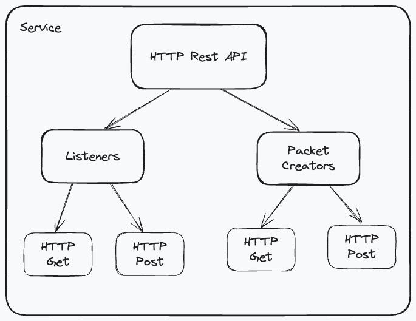
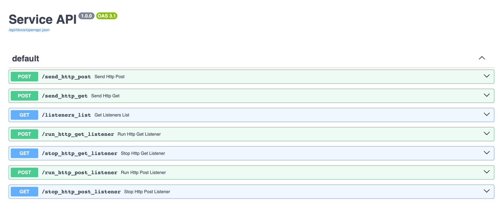
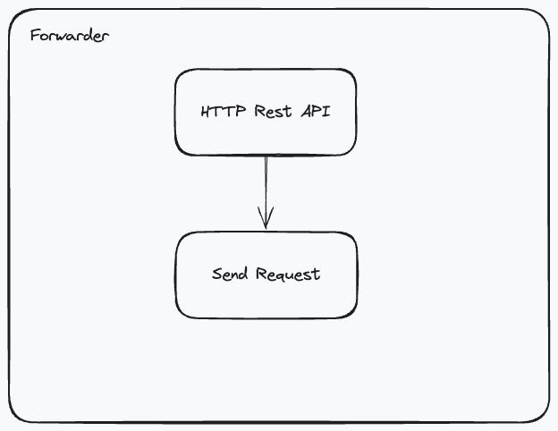
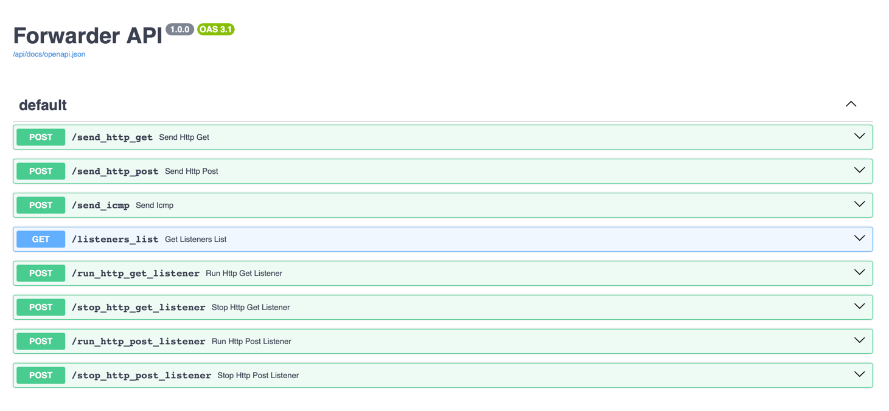

# Dev_IPS

This is a simple project that consists of two parts:
- [Service](service) - a simple HTTP API server that listens to the incoming requests runs listeners, creates packets, and sends them.
- [Forwarder](forwarder) - a simple program that listens to the incoming requests and sends them to the Service.


# Table of contents.

- [Requirements](#requirements)
- [Install in Linux or macOS](#install-in-linux-or-macos)
- [Configurations](#configurations)
- [Service](#service)
- [Forwarder](#forwarder)


# Requirements.

- Python 3.8 or higher.
- [Scapy](https://scapy.net/) - a powerful interactive packet manipulation program.
- [FastAPI](https://fastapi.tiangolo.com/) - a modern, fast (high-performance), web framework for building APIs with Python 3.6+ based on standard Python type hints.
- [Uvicorn](https://www.uvicorn.org/) - a lightning-fast ASGI server implementation, using uvloop and httptools.


# Install in Linux or macOS.

Clone the repository:
```bash
git clone https://github.com/KhachaturAvetisyan/Dev_IPS
```

Chose service:
```bash
cd Dev_IPS/service
```
or
```bash
cd Dev_IPS/forwarder
```

Create a virtual environment:
```bash
python3 -m venv .venv
```

Activate the virtual environment:
```bash
source .venv/bin/activate
```

Install the requirements:
```bash
pip install -r configs/requirements.txt
```

Run the service:
```bash
python3 run.py
```


# Configurations.

Every service has its own configuration file in the **configs** directory. 
You can change the configuration by editing the file by name **configs.json**.

- [Service configuration file](service/configs/configs.json)
- [Forwarder configuration file](forwarder/configs/configs.json)

Now we can configure the service HTTP API server host and port.
This is an example of the configuration file:

```json
{
  "api_server":
  {
    "host": "0.0.0.0",
    "port": 9044
  }
}
```


# Service.

The service is a simple HTTP API server that listens to the incoming requests and sends them to the forwarder.



The service consists of several parts:
- [API server](service/src/api_server) - listens to the incoming requests.
- [Listeners](service/src/listeners) - simple listeners that run on the child process 
(for example [HTTP Get Listener](service/src/listeners/http_get_listener.py)). 
- [Packet Creators](service/src/packet_creators) - create packets and send them
(for example [http get packet](service/src/packet_creators/scapy_get.py)). 

The service has a simple API that allows you to send requests.
Once the service has been launched, you can see the API **Swagger documentation** by visiting the following link:
```
http://<host>:<port>
```



# Forwarder.

The forwarder is a simple program that listens to the incoming requests and sends them to the service.



The forwarder have only one part:
- [API Server](forwarder/src/api_server.py) - listens to the incoming requests and sends them to the service.

Once the service has been launched, you can see the API **Swagger documentation** by visiting the following link:
```
http://<host>:<port>
```
